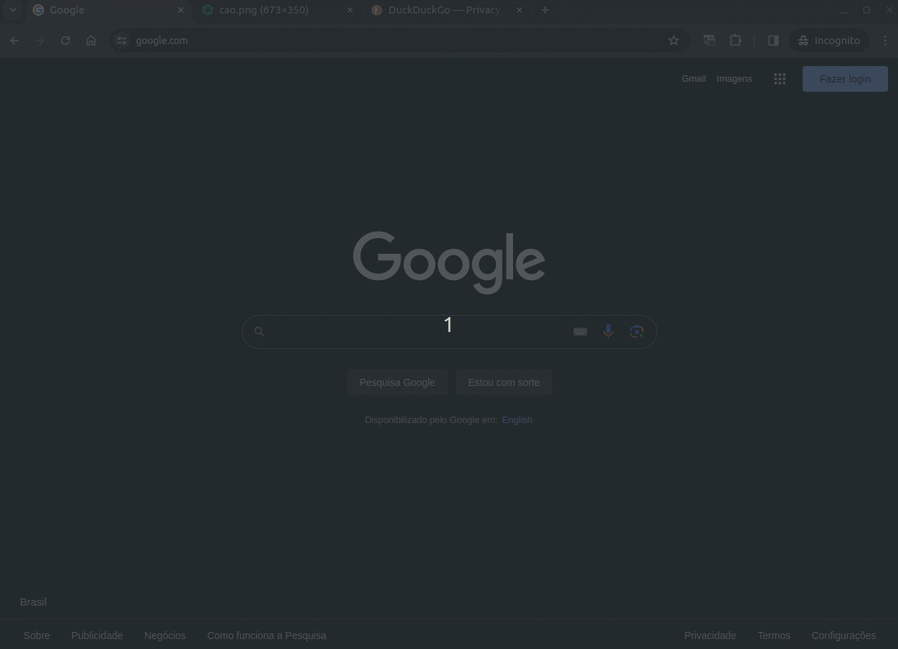

# Extension URL Switch



This extension allows you to set URL redirects in chrome browser.


---
## Used Technologies
- Vue 3
- Typescript
- Vuetify
- Material Design 3
- Manifest 3
- Chrome API


---
## Development

#### 1 - Install dependencies

```
  pnpm install
```

#### 2.1 - Layout development only

```
  pnpm dev
```

#### 2.2 - Test extension

1. Env:
    - For load unpacked extension `pnpm build:all`
    - For load only backend `pnpm build:backend`
2. On Chrome, go to `Manage Extensions`;
3. Enable `Developer Mode`;
4. Click on `Load unpacked`;
5. Select `dist` folder generated from first step;

---
## Production

Build the application for production:

```bash
pnpm build:all
```
